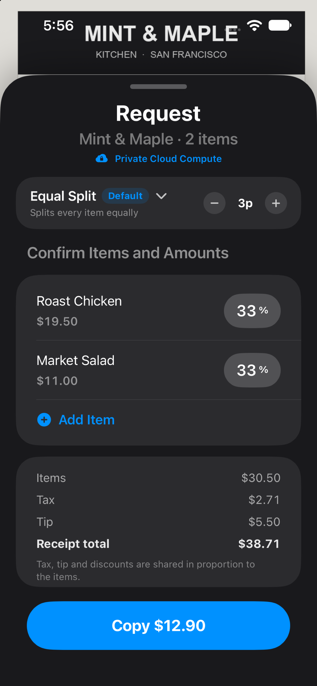
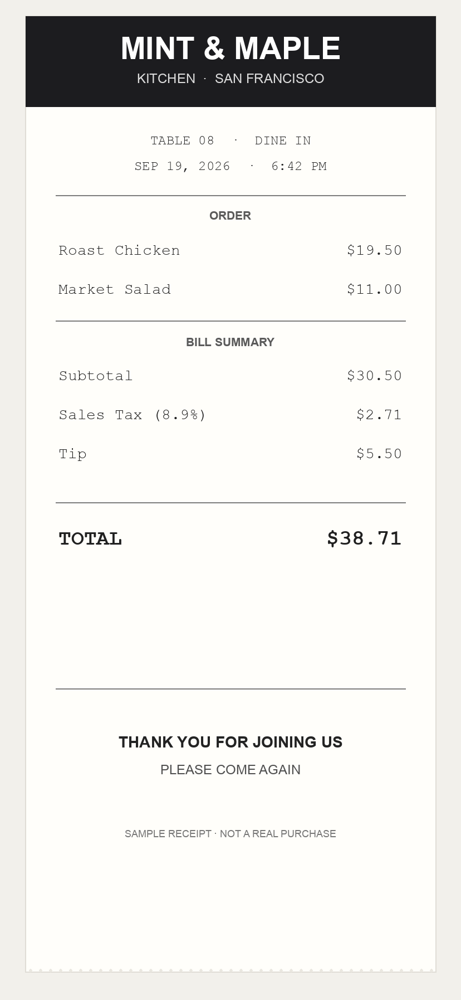

<section class="billsplit-hero" aria-labelledby="billsplit-title">

<figure class="billsplit-main-shot">

</figure>
<figure class="billsplit-receipt-card">

<figcaption>Start with the receipt</figcaption>
</figure>

BILLSPLIT · FOR IPHONE

<h1 id="billsplit-title">Split the bill. Keep it fair.</h1>

A clear, item-by-item way to split a restaurant check. Assign dishes, share tax and tip proportionally, and see what everyone owes. BillSplit doesn’t transfer bill payments or send payment requests; optional support tips use Apple’s in-app purchase system.

<a class="billsplit-contact-button" href="mailto:billsplit@flycricket.support">Contact support ↗</a>

Questions or feedback? <a href="mailto:billsplit@flycricket.support">billsplit@flycricket.support</a>

</section>

<section class="billsplit-steps" aria-label="How BillSplit works">
<article>
01

<h2>Add the items</h2>
Start with the receipt and its itemized total.

</article>
<article>
02

<h2>Share each dish</h2>
Choose who had each item, including shared plates.

</article>
<article>
03

<h2>Check each share</h2>
See each person's share of the items, tax, and tip.

</article>
</section>

