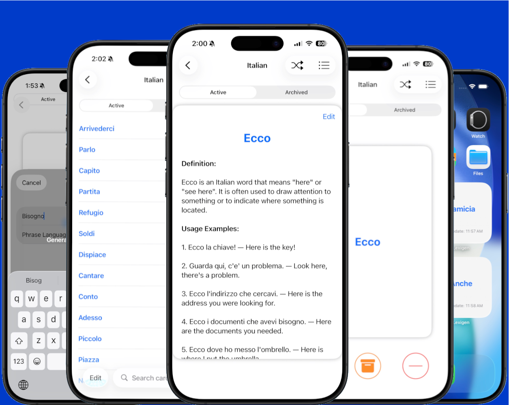

::::::{.lexigen}
:::::{.grid .gap-0 .container}
::::{.g-col-12 .g-col-md-7}

::::

::::{.text .g-col-12 .g-col-md-5}
[Lexigen]{.app-name}

[AI-powered flashcards for language learning - Definition and usage examples automatically generated by Apple’s on-device foundation models.]{.app-subtitle}

:::{.app-link}
:::{.app-link-item .qrcode}

:::

:::{.app-link-item .app-image}

:::
:::

:::{.support}
support email: lexigen@flycricket.support

[privacy policy](https://doc-hosting.flycricket.io/lexigen-privacy-policy/5b4d1d56-aab4-442c-8bad-c365dab98488/privacy)   |   [terms of use](https://doc-hosting.flycricket.io/lexigen-terms-conditions/403a661f-81db-463c-b2a4-23e0fe98e80e/privacy)
:::
::::
:::::
::::::