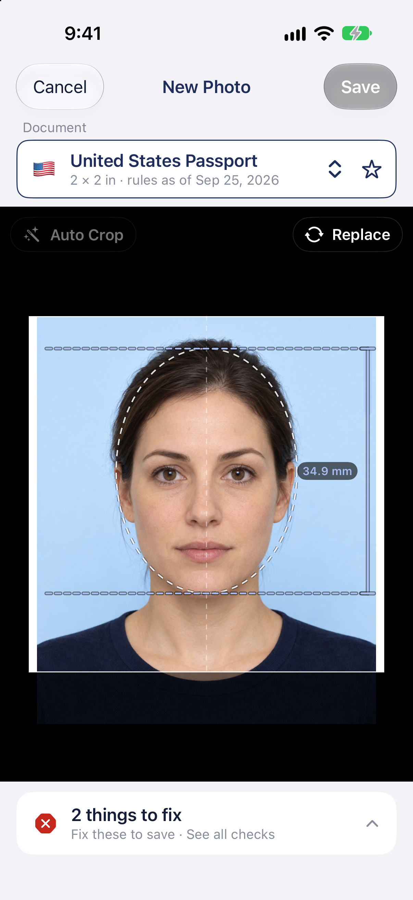
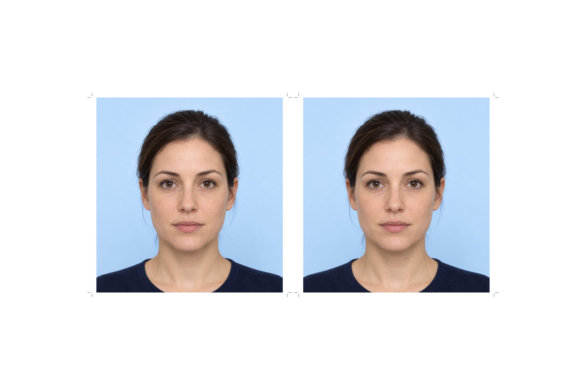

<section class="billsplit-hero" aria-labelledby="passphoto-title">

<figure class="billsplit-main-shot">

</figure>
<figure class="billsplit-receipt-card">

<figcaption>Print it on a 4×6 sheet</figcaption>
</figure>

PASSPHOTO · FOR IPHONE

<h1 id="passphoto-title">Passport photos. Right the first time.</h1>

Take or choose a photo, pick your document, and PassPhoto crops it to that document’s official rules for 46 countries and areas, plus the international ICAO standard. Faces are never retouched; the photo check runs on your iPhone or with Apple’s Private Cloud Compute. Optional support tips use Apple’s in-app purchase system.

<a class="billsplit-contact-button" href="mailto:passphoto@flycricket.support">Contact support ↗</a>

Questions or feedback? <a href="mailto:passphoto@flycricket.support">passphoto@flycricket.support</a>

<a href="https://feynlee.github.io/curiosity-notes/Apps/PassPhoto-privacy.html">Privacy policy</a>

Coming soon to the App Store

Scan to open PassPhoto on the App Store after Apple approves and releases it.

</section>

<section class="billsplit-steps" aria-label="How PassPhoto works">
<article>
01

<h2>Pick your document</h2>
Choose from 63 documents across 46 countries and areas, each with its official rules and source.

</article>
<article>
02

<h2>Take or choose a photo</h2>
The guided camera tells you when everything lines up.

</article>
<article>
03

<h2>Check, save and print</h2>
Review the photo against the document rules, then save it or make a 4×6 print sheet.

</article>
</section>

