[{fig-align="left"}](https://colab.research.google.com/github/feynlee/Stable_Diffusion/blob/main/dreambooth/DreamBooth_Stable_Diffusion.ipynb) [{fig-align="left" width=80px}](https://github.com/feynlee/Stable_Diffusion/tree/main/dreambooth)

## Train on Stable Diffusion V1.4

I adapted a Google Colab Notebook to fine-tune the stability diffusion model with DreamBooth, and added sections to save the trained model directly to HuggingFace, so it can be pulled from the hub in the future.

The following are some profile artworks generated by a model trained with photos of my face.
The results are pretty interesting.
Some of them do have some resemblance with me, while others do not look that much like me.

::::{.grid}

:::{.g-col-6 .g-col-md-4}
{group="composition"}
:::

:::{.g-col-6 .g-col-md-4}
{group="composition"}
:::

:::{.g-col-6 .g-col-md-4}
{group="composition"}
:::

:::{.g-col-6 .g-col-md-4}
{group="composition"}
:::

:::{.g-col-6 .g-col-md-4}
{group="composition"}
:::

:::{.g-col-6 .g-col-md-4}
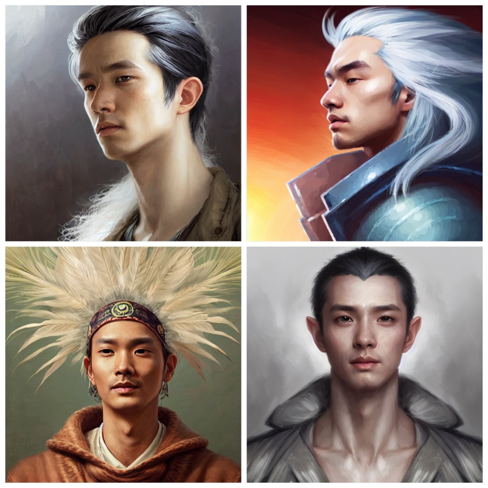{group="composition"}
:::

:::{.g-col-6 .g-col-md-4}
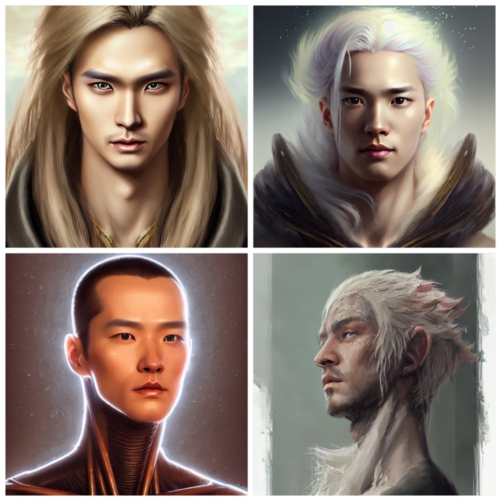{group="composition"}
:::

:::{.g-col-6 .g-col-md-4}
{group="composition"}
:::

:::{.g-col-6 .g-col-md-4}
{group="composition"}
:::

::::

## Train on the Arcane Diffusion

We can also train on fined-tuned stability models. I fine-tuned the [Arcane Diffusion Model](https://huggingface.co/nitrosocke/Arcane-Diffusion) on photos of me using the same [DreamBooth Notebook](https://colab.research.google.com/github/feynlee/Stable_Diffusion/blob/main/dreambooth/DreamBooth_Stable_Diffusion.ipynb).

The Arcane style got preserved, and now I can generate pictures of "me" in this style:

::::{.grid}

:::{.g-col-6 .g-col-md-4}
{group="arcane"}
:::

:::{.g-col-6 .g-col-md-4}
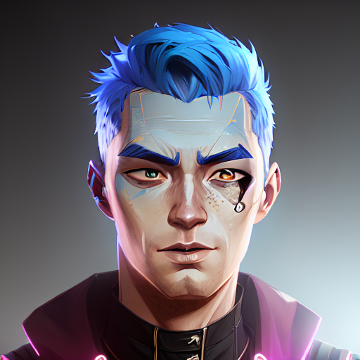{group="arcane"}
:::

:::{.g-col-6 .g-col-md-4}
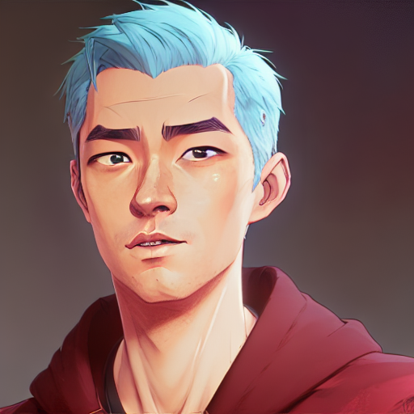{group="arcane"}
:::

:::{.g-col-6 .g-col-md-4}
{group="arcane"}
:::

:::{.g-col-6 .g-col-md-4}
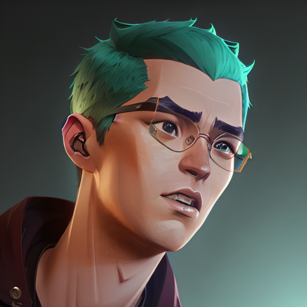{group="arcane"}
:::

:::{.g-col-6 .g-col-md-4}
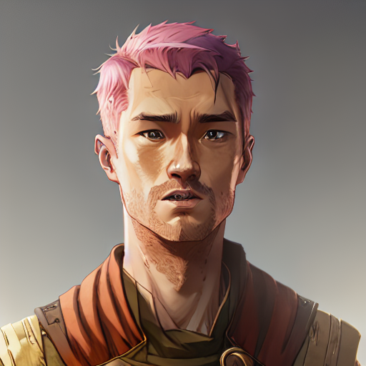{group="arcane"}
:::

:::{.g-col-6 .g-col-md-4}
{group="arcane"}
:::

:::{.g-col-6 .g-col-md-4}
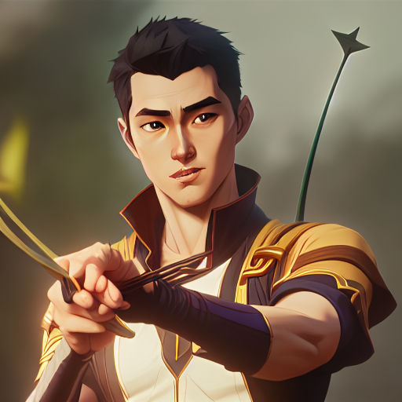{group="arcane"}
:::

:::{.g-col-6 .g-col-md-4}
{group="arcane"}
:::

:::{.g-col-6 .g-col-md-4}
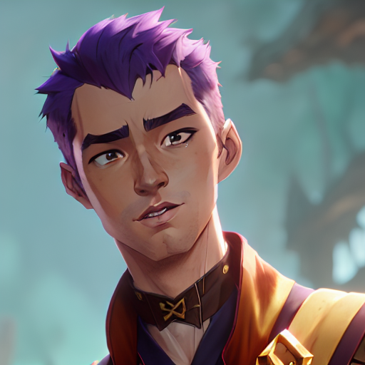{group="arcane"}
:::

:::{.g-col-6 .g-col-md-4}
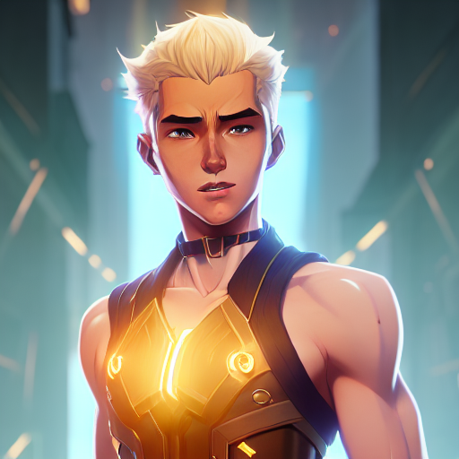{group="arcane"}
:::

:::{.g-col-6 .g-col-md-4}
{group="arcane"}
:::

:::{.g-col-6 .g-col-md-4}
{group="arcane"}
:::

:::{.g-col-6 .g-col-md-4}
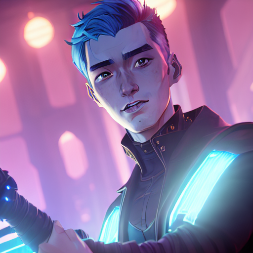{group="arcane"}
:::

:::{.g-col-6 .g-col-md-4}
{group="arcane"}
:::

:::{.g-col-6 .g-col-md-4}
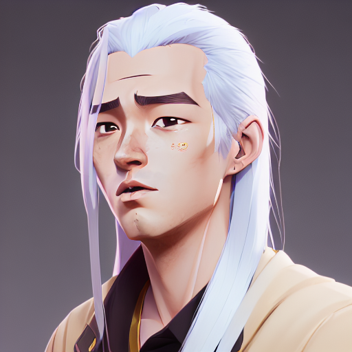{group="arcane"}
:::

:::{.g-col-6 .g-col-md-4}
{group="arcane"}
:::

:::{.g-col-6 .g-col-md-4}
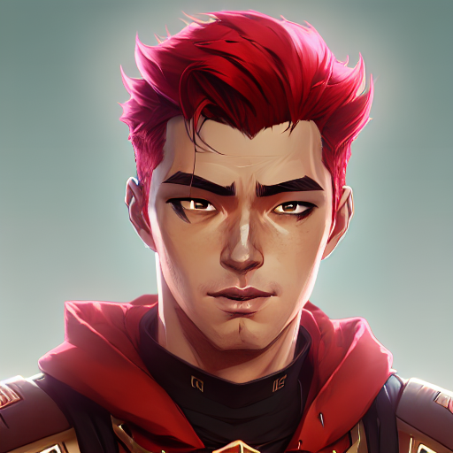{group="arcane"}
:::

:::{.g-col-6 .g-col-md-4}
{group="arcane"}
:::

:::{.g-col-6 .g-col-md-4}
{group="arcane"}
:::

:::{.g-col-6 .g-col-md-4}
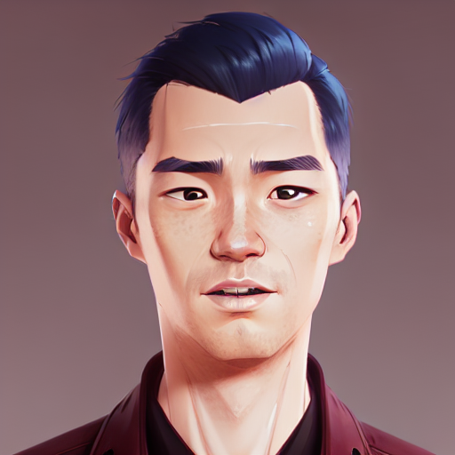{group="arcane"}
:::

:::{.g-col-6 .g-col-md-4}
{group="arcane"}
:::

:::{.g-col-6 .g-col-md-4}
{group="arcane"}
:::

:::{.g-col-6 .g-col-md-4}
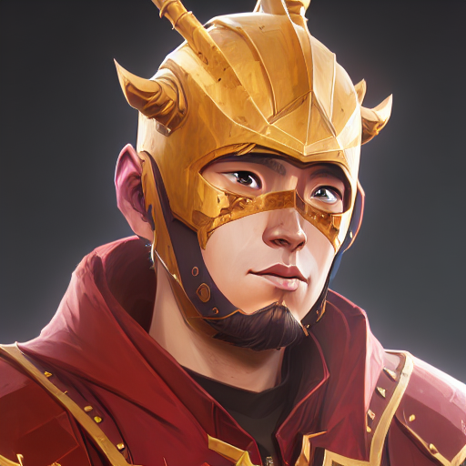{group="arcane"}
:::

::::