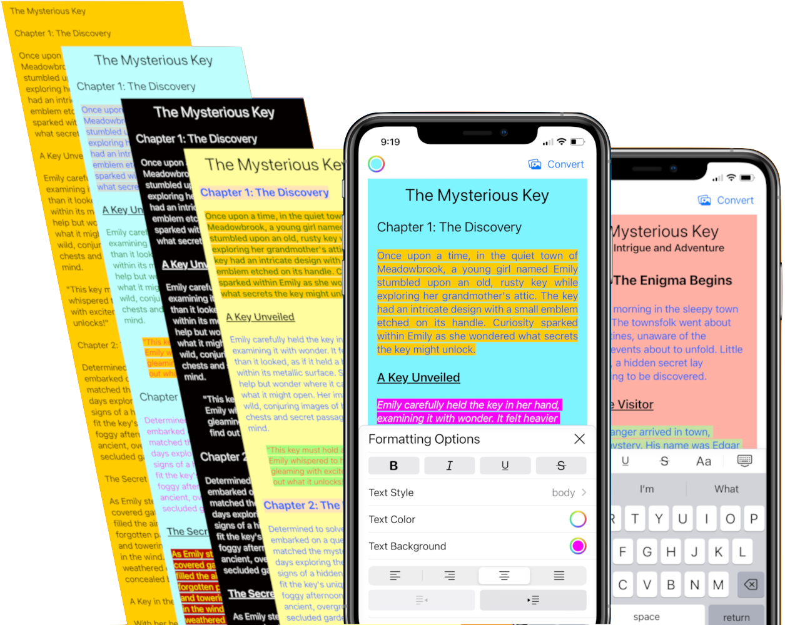

::::::{.long-text-pic}
:::::{.grid .gap-0 .container}
::::{.g-col-12}

::::

::::{.text .g-col-12}
[Long Text Pic]{.app-name}

[Edit long text and convert it
to a long image for sharing]{.app-subtitle}

:::{.app-link}
:::{.app-link-item .qrcode}

:::

:::{.app-link-item .app-image}

:::
:::

:::{.support}
support email:
long-text-pic@flycricket.support

[privacy policy](https://doc-hosting.flycricket.io/long-text-pic-privacy-policy/9fb63f5d-7387-4a59-a7b5-e9f31aff2121/privacy)   |   [terms of use](https://doc-hosting.flycricket.io/long-text-pic-terms-of-use/225e88ee-450f-4fad-8403-42113088f4b6/terms)
:::
::::
:::::
::::::
