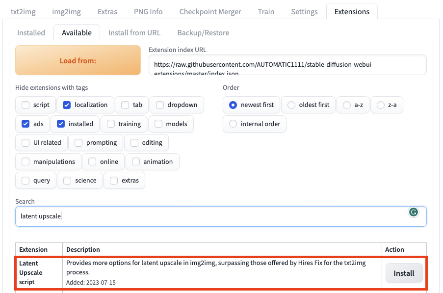
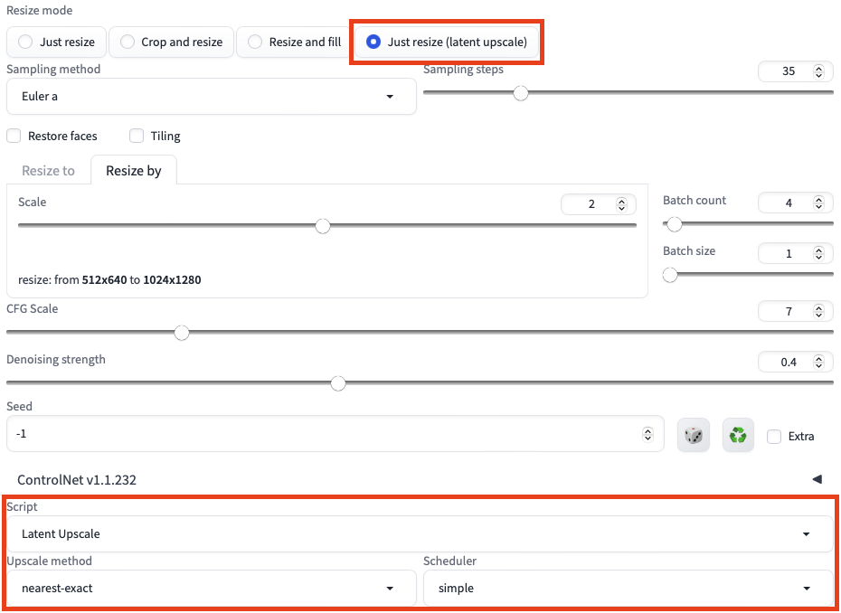
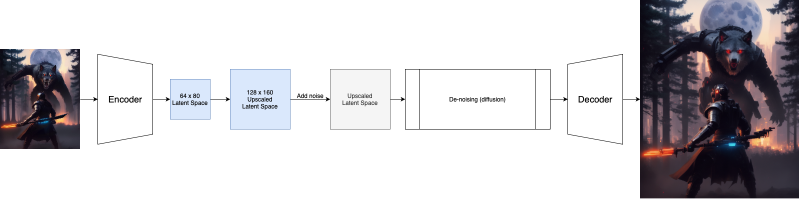
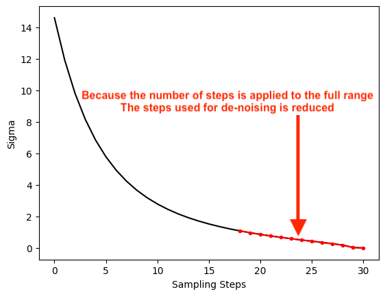
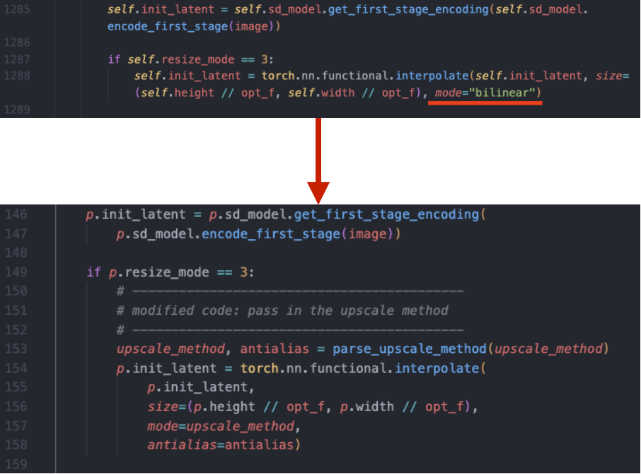
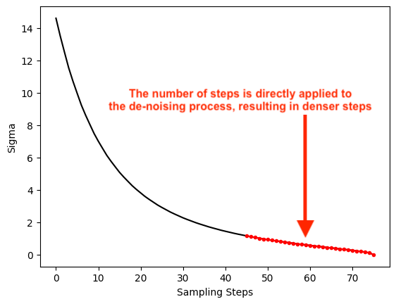

[{fig-align="left" width=80px}](https://github.com/feynlee/latent-upscale)

Enhance the latent upscale options in the img2img process in [Automatic1111](https://github.com/AUTOMATIC1111/stable-diffusion-webui) to provide more flexibility and better image quality.

## Motivation

1. The current img2img process lacks the ability to select the "Hires Fix" latent upscale options.
2. The default latent upscale method ("bilinear") often produces blurry images.

This plugin introduces alternative interpolation methods for upscaling and offers different schedulers for the diffusion process, resulting in superior upscaled images.
Moreover, this plugin expands the upscale options available in the Latent Space, surpassing those offered by the "Hires Fix" for the txt2img process.

## Example Comparison

Original Image:

{width=50%}

The default latent upscale (choose Resize mode "latent upscale"):


Latent Upscale Plugin (Upscale method: "nearest-exact", Scheduler: "simple")


## Installation



You can find the "Latent Upscale" plugin in the **Available** section under the **Extensions** tab in the WebUI.
Simply search for "Latent Upscale" in the extension search bar to locate it and click on "install".

_Don't forget to go back to **Installed** and click on **Apply**._

## Usage



At the bottom of the **img2img** tab, you can select the newly installed **Latent Upscale** script in the **Script** dropdown menu.

To benefit from these enhancements, make sure you have the "Just resize (latent upscale)" option selected for **Resize mode**.
Additionally, all the parameters present in the user interface remain applicable, alongside the new options provided by this plugin in "Upscale Method" and "Scheduler".

## Tips

1. Opting for "nearest", "nearest-exact", or "area" in the Upscale Method and "simple" or "normal" in the Scheduler can often lead to crisper images.
   However, don't hesitate to experiment with different choices to discover the best outcome.
2. If you want more details in the image, you can try to increase the number of steps in the diffusion process.
   However, this will also increase the time required to generate the image.

---

## How this came about

This all started when I noticed that the default “Just resize (latent upscale)” mode in Automatic1111 produces foggy images, but when I played with latent upscale in [Comfyui](), the results are much sharper.

I wanted to figure out why.

> How Latent Upscale Works:
>
>The original image is first encoded into the latent space, which is upscaled by the correct factor before fed into the diffusion (de-noising) process, and then decoded to the upscaled image.
>
> 

I found 2 problems in Automatic1111's implementation:

1. It uses the [“bilinear” method](https://en.wikipedia.org/wiki/Bilinear_interpolation), which often results in blurry upscaled images.
It does not provide users with other options to choose from.

2. The number of steps users set was applied to the full scheduler, effectively reducing the steps for “de-noising”.
  For example, if the user sets the steps to be "30" and the de-noise strength is set to 0.4, the diffusion process will only run for 30*0.4 = 12 steps.
  

## Solutions

1. For problem 1, I simply replaced this line of code.
  Instead of hard coding the interpolation method, I allowed the users to choose their own method.

  

2. I turned on a fix that’s already in the code base but for some reason not applied by default:

  ```python
    opts.img2img_fix_steps = True
  ```

  so the de-noising process has the correct number of steps.

  


## Technical Details

1. This plugin overrides the default `init` method for `StableDiffusionProcessingImg2Img` to include additional features:

   1. It adds the option to choose the "Upscale Method" interpolation method when creating the latent image.
   2. It ensures that the diffusion process runs for the correct number of steps, as specified by the user, by setting opts.img2img_fix_steps = True. It is unclear why this was not the default setting for img2img.

2. This plugin assigns the `sampler_noise_scheduler_override` method for `StableDiffusionProcessingImg2Img` so that our custom schedulers can be used for the diffusion process.
