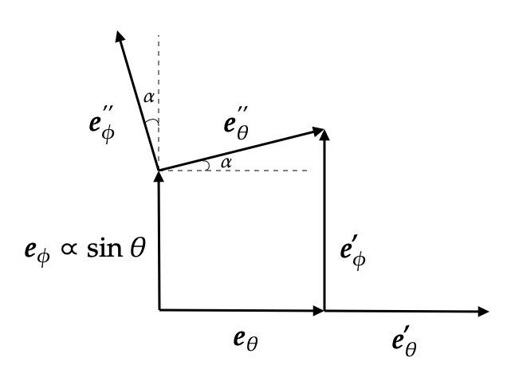

# introduction

# true parallel transport

## overview

how do we parallel transport a vector on a curved surface?

the most intuitive method is to look at parallel transport in a very small local area where it can be approximated as a flat surface.
in this small area, the parallel lines are easily defined, and we can therefore figure out how the coordinates rotate and twist relative to the parallel lines when we step in different directions.

we can denote the change of the basis vectors when we move on the surface as the follows:

$$\partial_{\mu}{\pmb{e}_j}=\gamma_{\mu j}^{i} \pmb{e}_i$$

the change of a arbitrary vector field is therefore

$$\partial_{\pmb{v}}\pmb{s} = v^{\mu}\partial_{\mu} (s^{i} \pmb{e}_{i}) = v^{\mu} (\partial_\mu s^i + \gamma_{\mu j}^{i} \pmb{e}_i s^j)$$

we can define the covariant derivate:

$$d_\mu = \partial_\mu s^i + \gamma_{\mu j}^{i} \pmb{e}_i s^j$$

which takes into account the change of coordinate basis on the curved surface, and thus is a true comparison of parallel transported vectors at the same location.

all we need to do now is figure out the Christoffel symbols $\gamma^{i}_{\mu j}$ for parallel transport.

## parallel transport on a 2d sphere

the metric tensor for the sphere encodes all the information we need to figure out how coordinates rotates relative to parallel transport.

let's use the surface of a sphere for illustration.
written on the spherical coordinates, the metric tensor for a sphere of radius $r=1$ is

$$g_{ij} = \left(\begin{matrix}
1 & 0 \\
0 & \sin^2\theta
\end{matrix}\right)$$

because $g_{ij}=\pmb{e}_i\cdot\pmb{e}_j$, we have

$$\begin{align}
|\pmb{e}_\theta|&=1 \\
|\pmb{e}_\phi|&=\sin\theta \\
\pmb{e}_\theta\cdot\pmb{e}_\phi&=0
\end{align}$$

this gives us the magnitude of each basis vector and the angle between them ($90\degree$).
we now have everything we need to draw the local changes of the coordinate basis as follows:

{fig-align=center}

we can clearly see, that because $\pmb{e}_\phi \propto \sin\theta$, the $\pmb{e}_\theta'$ is rotated.
the rotation angle $\alpha \approx \tan\alpha = d(\sin\theta)/d\theta = \cos\theta$.
and because the basis vectors here are alway orthogonal to each other, $\pmb{e}_\phi$ is also rotated by the same angle $\alpha$.
note that $\pmb{e}_\theta'$ should have the same length as $\pmb{e}_\theta$ according to the metric tensor, but it's impossible to draw this on a flat 2-d surface.
in order to satisfy the conditions spesified by the metric tensor, the surface has to be curved.
this demonstrates to us how the metric tensor specifies rotations and twist of coordinate basis and the geometry of the space.

focusing on the local changes of the basis vectors, we have

$$
\begin{align}
\frac{\partial\pmb{e}_\theta}{\partial\theta} &= \pmb{e}_\theta' - \pmb{e}_\theta=0 \\
\frac{\partial\pmb{e}_\theta}{\partial\phi} &= \pmb{e}_\theta'' - \pmb{e}_\theta=\cos\theta/\sin\theta \pmb{e}_\phi = \cot\theta \cdot\pmb{e}_\phi \\
\frac{\partial\pmb{e}_\phi}{\partial\theta} &= \pmb{e}_\phi' - \pmb{e}_\phi=\pmb{e}_\theta'' - \pmb{e}_\theta = \cot\theta \cdot\pmb{e}_\phi \\
\frac{\partial\pmb{e}_\phi}{\partial\phi} &= \pmb{e}_\phi'' - \pmb{e}_\phi=\tan\alpha \cdot|\pmb{e}_\phi| \cdot(-\pmb{e}_\theta)=-\cos\theta \sin\theta \cdot\pmb{e}_\theta\\
\end{align}$$

in other words,

$$
\begin{align}
\gamma^{\theta}_{ij} &= \left(\begin{matrix}1 & 0 \\ 0 & -\sin\theta\cos\theta\end{matrix}\right), \\
\gamma^{\phi}_{ij} &= \left(\begin{matrix}0 & \cot\theta \\ \cot\theta & 0 \end{matrix}\right).
\end{align}
$$

this example shows us that how the twist and changes of basis vectors are produced by the the metric tensor.
next, we show how we can derive the christoffel symbols from arbitrary metric tensors.

## parallel transport for arbitrary metric tensor

$$
\begin{align}
\partial_\gamma g_{\alpha\beta} &= \partial_\gamma (\pmb{e}_\alpha \cdot \pmb{e}_\beta) \\
&= (\partial_\gamma \pmb{e}_\alpha)\cdot \pmb{e}_\beta + \pmb{e}_\alpha \cdot (\partial_\gamma\pmb{e}_\beta) \\
&= \gamma_{\gamma\alpha}^{\mu} \pmb{e}_\mu \cdot \pmb{e}_\beta + \gamma_{\gamma\beta}^{\mu} \pmb{e}_\mu \cdot \pmb{e}_\alpha \\
&= \gamma_{\gamma\alpha}^{\mu} g_{\mu\beta} + \gamma_{\gamma\beta}^{\mu} g_{\mu\alpha}
\end{align}
$$

### Torsion Free and Metric Compatibility

## What does the Torsion Tensor Describe

In differential geometry, the torsion tensor is a type of tensor that describes how tangent surfaces twist or skew when they are parallel transported along a curve. This can be seen by considering the effect of parallel transport on the covariant derivative of a vector field.

Recall that the covariant derivative of a vector field X along a curve C is given by the following equation:

$D_XY = \frac{\partial X}{\partial s} + \Gamma_{ij}^k X^j \frac{\partial y^i}{\partial x^k}$

where $X$ is the vector field, $s$ is the arc length along the curve, $\Gamma_{ij}^k$ are the Christoffel symbols, and $y^i$ are the coordinates of the curve.

Now, consider what happens when we parallel transport a tangent vector $Y$ along the curve C. This means that we keep the vector $Y$ constant as we move along the curve, so its covariant derivative should be zero:

$D_XY = 0$

Substituting the expression for the covariant derivative into this equation, we get:

$\frac{\partial X}{\partial s} + \Gamma_{ij}^k X^j \frac{\partial y^i}{\partial x^k} = 0$

We can rearrange this equation to solve for the Christoffel symbols:

$\Gamma_{ij}^k = -\frac{\partial X^k}{\partial s} \frac{\partial y^i}{\partial x^j}$

This equation shows that the Christoffel symbols, which are components of the connection, are determined by the rate of change of the vector field along the curve. In other words, the connection encodes information about how the vector field twists or skews as it is parallel transported along the curve.

The torsion tensor is then defined as the antisymmetric part of the connection:

$T_{ij}^k = \Gamma_{ij}^k - \Gamma_{ji}^k$

This means that the torsion tensor encodes information about how the vector field twists or skews as it is parallel transported along the curve, relative to the direction of the curve. In other words, the torsion tensor describes how tangent surfaces twist or skew about a curve when they are parallel transported.

# generalized "parallel transport"

# the mathematical rabbit hole

## differential geometry

## fiber bundle

## topology

### ChatGPT

In Einstein-Cartan theory, the torsion tensor is a mathematical object that describes the magnitude and direction of the torsion at each point in spacetime. It is typically denoted by the symbol $T^{\mu}_{\nu \lambda}$, where the indices $\mu, \nu, \lambda$ represent the coordinates of spacetime. The torsion tensor is related to the connection coefficients, or Christoffel symbols, by the following equation:

$$T^{\mu}{\nu \lambda} = \Gamma^{\mu}{\nu \lambda} - \Gamma^{\mu}_{\lambda \nu}$$

where $\Gamma^{\mu}_{\nu \lambda}$ are the connection coefficients. The torsion tensor can be used to calculate the curvature of spacetime due to torsion, and to determine the effects of torsion on the motion of particles in spacetime.

In general, the torsion tensor is a tensor of rank 3, which means that it has three indices and can be thought of as a 3-dimensional array of numbers. The magnitude of the torsion at a given point in spacetime is determined by the magnitude of the torsion tensor at that point, and the direction of the torsion is determined by the orientation of the tensor.

I hope this helps to clarify the mathematical definition of the torsion tensor in Einstein-Cartan theory. Please let me know if you have any other questions.