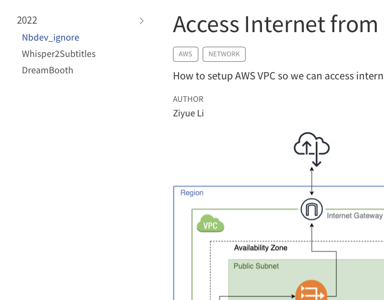
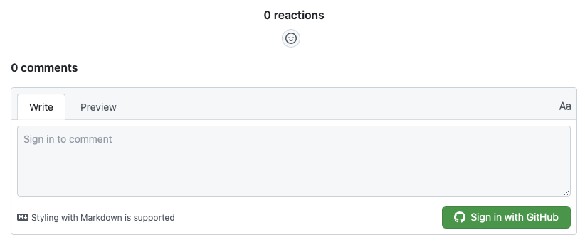
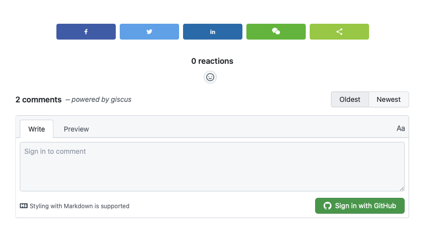

>It took me some time to migrate to [Quarto](https://quarto.org).
>Here are some the tips that might be helpful if you are thinking about doing the same.

:::{.callout-tip}

## Tip

Explore the [GitHub Repo for this Website](https://github.com/feynlee/curiosity-notes) to see how it's set up.
:::

## Different Sidebars for Different Contents

On this website, you will see multiple sections: Posts, TIL, Books ...
Many of them have their own sidebars.
For example, see one of the posts in [TIL](https://feynlee.github.io/curiosity-notes/TIL/2022/2022-11-23-aws-private_subnet_setup.html).
On the left-hand side is the sidebar to jump to other posts quickly.

<!-- {width=50%, fig-align=center} -->


This is easy to set up by simply having multiple sidebars in `_quarto.yml`.
However, there seems to be a bug when you only have one sidebar configured.
That one sidebar will show up across your website, even for pages unrelated to that sidebar.

As of this writing, an easy way to solve this is to make another empty sidebar:

```yml
sidebar:
  - id: til
    title: TIL
    contents:
      - section: '2022'
        contents:
        - text: Nbdev_ignore
          href: TIL/2022/2022-11-23-aws-private_subnet_setup.ipynb
        - text: Whisper2Subtitles
          href: TIL/2022/2022-11-16-fastai-store_attr_infinite_recursion.ipynb
        - text: DreamBooth
          href: TIL/2022/2022-11-15-fastai-show_training_loop.ipynb
  - id: empty sidebar
```


## Enable Line Numbers in Code Blocks

Some useful settings for code blocks in `_quarto.yml`:

```yml
format:
  html:
    code-line-numbers: "1"
    code-block-bg: true
    code-block-border-left: true
    code-copy: true
    code-fold: false
```

## Add A Comment Section that Supports Latex

<!-- {width=50%, fig-align=center} -->

[Giscus](https://giscus.app) is a comments system powered by [GitHub Discussions](https://docs.github.com/en/discussions).
It supports Latex, so that visitors can type math equations in the comment section.

Make sure you configure the `repository` and the `Discussion Category` on [Giscus](https://giscus.app), this will generate the script code.
We don't need to copy that code, but we do need to note the `data-repo-id`, and `data-category-id`.

To enable it for a page, include the following in the YAML front matter:

```yml
comments:
  giscus:
    repo: <GitHub Repo for Your Quarto Website>
    repo-id: <Your data-repo-id>
    category: <The Discussion Category>
    category-id: <Your data-category-id>
    mapping: "title"
    reactions-enabled: true
    loading: lazy
    input-position: "top"
    theme: "preferred_color_scheme"
```

## Add RSS Feed

<!-- {width=50%, fig-align=center} -->

1. Add `feed: true` in the listing page
    Include a feed for your listing by including the `feed` option in your listing page:

    ```yml
    listing:
      contents: posts
      feed: true
    ```

    An RSS file will automatically be generated using the name of the the file in the same location as the listing page. For example, `index.qmd` will produce a feed at `index.xml`.

2. Include the path to the xml file

    We need to explicitly include links to these xml files.
    In this website, I created 3 RSS feeds: Posts, TIL and Projects, and included them in `_quarto.yml` under a menu on the right side of the navigation bar:

    ```yml
    website:
      navbar:
        right:
          - icon: rss
            menu:
            - text: Subscribe to Posts
                icon: rss
                href: https://feynlee.github.io/curiosity-notes/index.xml
                aria-label: Posts RSS
            - text: Subscribe to TIL
                icon: rss
                href: https://feynlee.github.io/curiosity-notes/TIL.xml
                aria-label: TIL RSS
            - text: Subscribe to Projects
                icon: rss
                href: https://feynlee.github.io/curiosity-notes/projects.xml
                aria-label: Projects RSS
    ```

## Add Social Share Buttons

<!-- {width=50%, fig-align=center} -->

There's already an option to add social share buttons through the Quarto extension [quarto-social-share](https://github.com/schochastics/quarto-social-share).
However, I'd like to use [sharethis](https://sharethis.com), and I want to make them appear above the comment section, immediately after each post.

After you configured the share buttons on [sharethis](https://sharethis.com), it will generate a header code and buttons code.

### Header Code

For the header code, we can include it in the header of the website, by adding the following in `_quarto.yml`:

```yml
format:
  html:
    header-includes: <script type="text/javascript" src="https://platform-api.sharethis.com/js/sharethis.js#property=**************&product=inline-share-buttons&source=platform" async="async"></script>
```

### Buttons Code

For the buttons code, one could've included it at the bottom of each post manually, so that the share buttons appear there.
However, I'd like to do this more efficiently, so I created an extension: [code-insertion](https://github.com/feynlee/code-insertion).

Here's what you need to do to enable this:

- Install Extension

  ```sh
  quarto add feynlee/code-insertion
  ```

  This will install the extension under the _extensions subdirectory. If you're using version control, you will want to check in this directory for your Quarto website.

- Create a Markdown file to store the buttons code

  Create a markdown file (html also works) `_sharebuttons.md`:

  ```md
  <div class="sharethis-inline-share-buttons pt-5"></div>
  ```

  The `pt-5` is a [Bootstrap class](https://getbootstrap.com/docs/4.0/utilities/spacing/#examples) to make sure there's enough space between the post and the share buttons.

  Make sure to start the file name with an underscore, so that Quarto ignores it when generating htmls.

- Enable the filter in `_metadata.yml` for all posts

  In the front matter of a post, the code-insertion filter and add insert-before-post and/or insert-after-post parameters that point to a markdown file with sections you want to insert before and/or after the post.

  Create a `_metadata.yml` file under the folder that contains all of your posts.
  Any settings here will be shared by all posts.
  Enable the `code-insertion` filter:

  ```yml
  filters:
    - code-insertion
  insert-after-post: _sharebuttons.md
  ```

  Note that you should put the path to your `_sharebuttons.md` file for `insert-after-post`.
  This will insert that code as the last block in your post, which is above the comment section.

## Add An Annotation Tool

You can enable [hypothes](https://web.hypothes.is) on your website so that visitors can highlight and annotate your posts.

```yml
comments:
  hypothesis:
    theme: clean
```

This is enabled for my website.
You can see the Hypothesis UI at the far right of the page.
You can also drag cursor over texts to make your own highlights and annotations on this page.

## Enable Anchor Sections

Hover over a section title to see an anchor link.
An anchor link makes it possible to share and reference the exact position of the specified section.
Enable/disable this behavior with:

```yml
format:
  html:
    anchor-sections: true
```

Anchor links are also automatically added to figures and tables that have a [cross reference](https://quarto.org/docs/authoring/cross-references.html) defined.

## A Custom Listing Page

The [Books](https://feynlee.github.io/curiosity-notes/books/books.html) page on this website is created with a [custom listings](https://quarto.org/docs/websites/website-listings-custom.html) page.
With [EJS Template](https://ejs.co), one can create a very customized listings page to suit one's needs.

[Sorting, filtering and pagination](https://quarto.org/docs/websites/website-listings-custom.html#sorting-filtering-and-pagination) can also be enabled for your listings page with very little effort.

