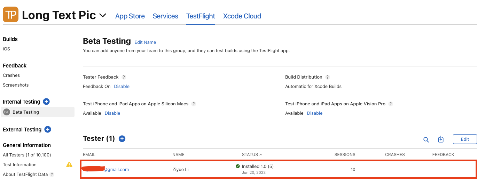

[{width=80%}](https://feynlee.github.io/curiosity-notes/Apps/Long-Text-Pic.html)

<!--  -->
I just released [my first iOS app](http://feynlee.github.io/curiosity-notes/Apps/Long-Text-Pic.html), and man did I underestimate the App Submission process!
I wish there was a handy compilation of resources and tips from someone that just went through this.
That could've saved me loads of time!

So I'm sharing my learnings here for people like me.

[This video](https://www.youtube.com/watch?v=ykiD5wqwSe4&embeds_referring_euri=http%3A%2F%2Flocalhost%3A3682%2F&source_ve_path=OTY3MTQ&feature=emb_imp_woyt) provides great instructions on how to submit your app to the App Store.
I won't repeat what has already been mentioned in the video.
Instead, I will focus on the issues I encountered during the submission process that are not covered in the video.

## You Can Bypass Setting Up Export Compliance in App Store Connect

After archiving your app and uploading it to App Store Connect, you will be prompted to set up export compliance.
Refer to the screenshot below to see the "missing compliance" status for BUILD 2.

You can actually bypass the process of setting up export compliance in App Store Connect by specifying your use of encryption directly in the information property list (Info.plist) of your Xcode project.

To do this, add the `App Uses Non-Exempt Encryption` key to your Info.plist file and set its value to `NO`.

## TestFlight

Make use of TestFlight to ensure that your app functions properly before submission!

You can set up a beta testing group and add yourself as a tester.

Next, download the TestFlight app from the App Store and install your app for testing purposes.
During testing, you will not be charged for in-app purchases when you click on the purchase button.

I neglected to use TestFlight for beta testing my app, and as a result, I had to wait for two days for my app to be rejected due to missing in-app purchases, as explained in the next section.
Subsequently, it took an additional day for my app to be approved after resolving these issues.

## In-App Purchase

### How to Set Up In-App Purchase in Your Code



You can obtain the author's [demo code](https://github.com/olopsman/storekit2-youtube-demo) from GitHub.
With minimal modifications, you can utilize the demo code to implement in-app purchases in your app.

### Setting Up In-App Purchase on App Store Connect

- Product IDs

  While I was following the video without fully comprehending how product IDs are used, I encountered some issues when submitting my app on App Store Connect.

  Here's the crucial part that I overlooked:

  :::{.callout-important}
  The Product IDs you set up on App Store Connect must match those you used during local testing, specifically the ones you configured with the `Product.storekit` file.
  :::

  

  

  Failing to do so will result in your app being unable to find the expected products, and the in-app purchase will not appear correctly.
  This is where beta testing with TestFlight would have been beneficial in identifying this issue.

- Paid Agreement

  There are [a few other configurations](https://developer.apple.com/help/app-store-connect/configure-in-app-purchase-settings/overview-for-configuring-in-app-purchases) required for In-App Purchase. One of them is to accept the paid agreement.
  You can find the paid agreement in the "Agreements, Tax, and Banking" section of App Store Connect.

  

  You will need to set up a bank account for accepting payments, which leads us to the next section: sole proprietorship.

## Sole Proprietorship

If you're a solo developer in the U.S., like myself, working on your first app as a side hustle, you are technically a sole proprietor without the need to register anything with the government.
**However, please note that I am not a lawyer, and this is not legal advice.**
It's important to consult with your local government to determine the requirements for establishing a sole proprietorship.

As a sole proprietor, it's recommended to keep your personal and business finances separate by setting up a business bank account.
Contrary to my initial expectations, obtaining a business bank account turned out to be much easier than anticipated.
I opted for one from [Novo](http://novo.co), which offers zero monthly fees, zero minimum balance, and exclusive partner perks.
My application was approved within a day.

You can use my [referral link](https://onboarding.novo.co/signup?referral_code=ZiyueLi) to receive $40 when opening a new account with Novo.

Having a business bank account will help you maintain separate records for your business transactions, simplifying the process during tax season.

## App Preview

When providing screenshots, it is important to adhere to specific sizes.
To create visually appealing screenshots, you can utilize free tools such as [https://app-mockup.com](https://app-mockup.com) or [https://app.flycricket.com](https://app.flycricket.com).

Additionally, you may need to prepare screenshots for the 5.5" iPhone screen size.

## Privacy Policy

As a first-time app creator, I was unaware that releasing an app requires more than just the app itself. Creating a privacy policy seemed daunting, and I didn't want to incur the expense of hiring a lawyer.

After conducting some research, I came across the website [https://app-privacy-policy-generator.firebaseapp.com](https://app-privacy-policy-generator.firebaseapp.com), which has been utilized by many solo developers.

You can host your privacy policy for free on [flycricket](https://www.flycricket.com).

## Support URL

A support URL is a required element.
Some people suggest that using a WordPress website, a Facebook page, or other social media pages is sufficient.
However, I created [a dedicated page for my app](https://feynlee.github.io/curiosity-notes/Apps/Long-Text-Pic.html), which also serves as a marketing page.

You can use [flycricket](https://www.flycricket.com) to create a support email.

## Marketing Assets

Once your app is approved, you can obtain a link to the app and relevant marketing materials, including a QR code and the App Store badge, using the App Store Marketing Tools available at [https://developer.apple.com/app-store/marketing/guidelines/](https://developer.apple.com/app-store/marketing/guidelines/).
